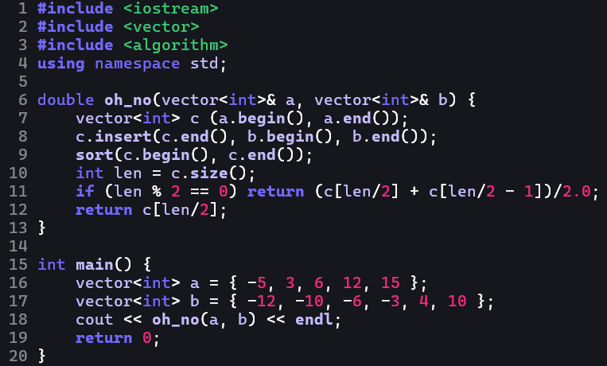

# mymynyte

_A simple dark Neovim colorscheme_.



This colorscheme supports C, C++, Lua and Python.

## How to install

As we use Treesitter highlight groups, make sure [Treesitter](https://neovim.io/doc/user/treesitter/) is already installed (Neovim v0.5.0+ already is integrated with it). The steps below work for lazy.nvim.

If you wish to use the remote repository on GitHub, simply add this to your require("lazy").setup(...) line:

```lua
require("lazy").setup({
    ...
    {
        "nik-kotine/mymynyte",
        name = "mymynyte",
    }
    ...
})
```

If you wish to use a local repository instead, change the first line to the absolute path to your local copy of the repository:

```lua
require("lazy").setup({
    ...
    {
        dir: %ABSOLUTE_PATH_TO_REPOSITORY%,
        name = "mymynyte",
    }
    ...
})
```

Finally, change the colorscheme:

```lua
vim.cmd.colorscheme("mymynyte")
```
